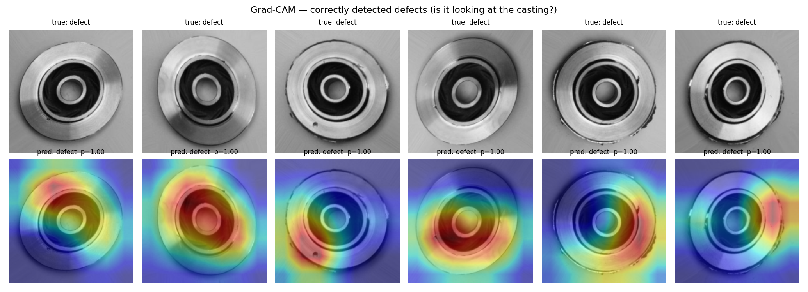
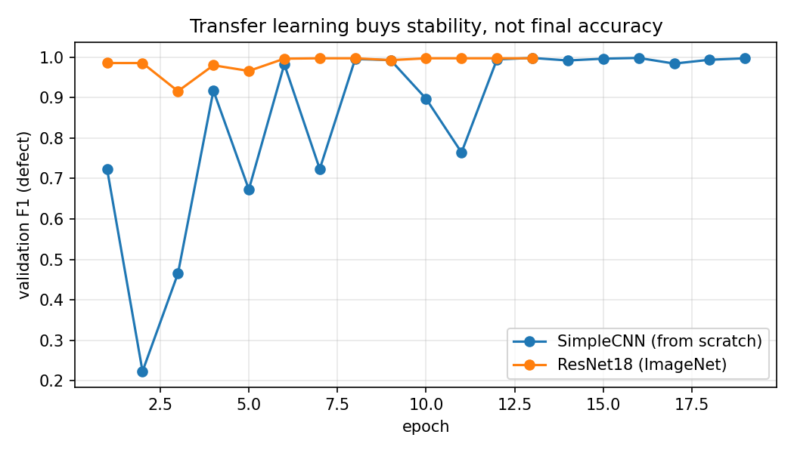
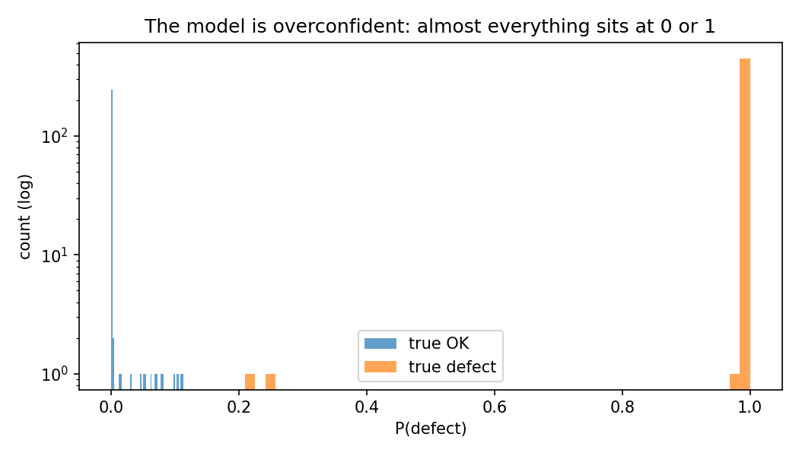
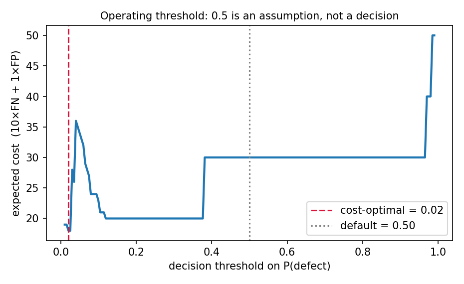
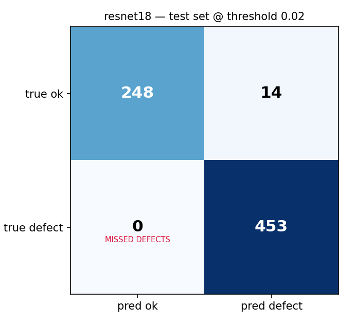
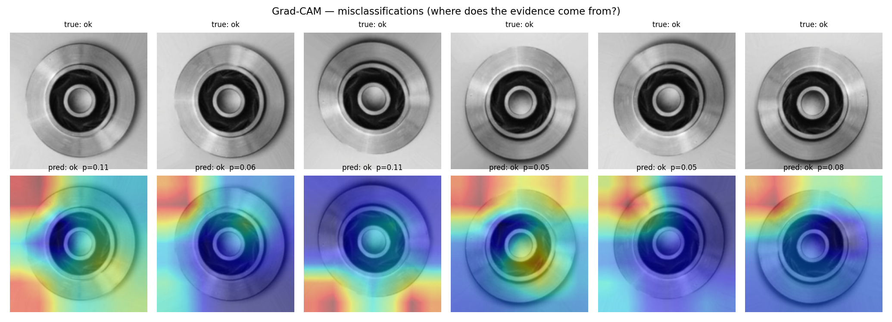

# Casting Defect Detection — Explainable Visual Quality Inspection

Binary classification of submersible-pump impeller castings as **OK** or **defective**, using a CNN with **Grad-CAM** explanations and a **cost-based decision threshold** rather than an arbitrary 0.5.

> **Why this framing.** In automated optical inspection a missed defect (a bad part shipped to a customer) is far more expensive than a false alarm (a good part pulled for 30 seconds of manual re-inspection). Accuracy hides this asymmetry entirely. This project measures and optimises against it explicitly.



---

## Results

Test set: 715 images (453 defective, 262 OK). The test split was evaluated **once**, after all model selection and threshold tuning was completed on validation.

| Model | Params | Accuracy | Precision (defect) | Recall (defect) | F1 | ROC-AUC | Missed defects | False alarms |
|---|---|---|---|---|---|---|---|---|
| SimpleCNN (from scratch) | ~0.4 M | 0.9958 | 1.0000 | 0.9934 | 0.9967 | 1.0000 | 3 | 0 |
| ResNet18 (ImageNet, fine-tuned) | ~11 M | **0.9972** | 1.0000 | 0.9956 | **0.9978** | 1.0000 | **2** | 0 |
| ResNet18 @ argmin threshold (0.016) | ~11 M | 0.9804 | 0.9700 | **1.0000** | 0.9848 | 1.0000 | **0** | 14 |
| ResNet18 @ 1-SE plateau threshold (0.228) | ~11 M | **0.9986** | **1.0000** | 0.9978 | **0.9989** | 1.0000 | 1 | **0** |

### Finding 1 — transfer learning did not improve final accuracy

ResNet18 beat a from-scratch 4-block CNN by **one defect out of 453**. With 28x the parameters and ImageNet pretraining, that is within noise. On this dataset, transfer learning is not why the model works.

**What it did buy was convergence.** ResNet18 reached 0.986 validation F1 **in a single epoch** and was stable from then on. SimpleCNN thrashed for eight epochs — validation F1 went `0.72 -> 0.22 -> 0.47 -> 0.92 -> 0.67 -> 0.98 -> 0.72 -> 0.99` — repeatedly collapsing into degenerate all-one-class solutions before finding a boundary, and needed 19 epochs to get there.



The practical reading: with 6,600 clean, well-lit, centred images, a small CNN can learn this task from scratch. Pretrained features matter for *stability and sample efficiency*, and would matter far more with a few hundred images or a harder capture setting — which is the realistic industrial case.

### Finding 2 — the model-selection metric mattered more than the architecture

An earlier run selected checkpoints on **defect recall**. A model that predicts "defect" for every part scores recall = 1.0, the maximum possible value. The checkpoint saver therefore locked onto that degenerate model at epoch 1 and never moved:

```
acc = 0.6336 = 453/715   <- exactly the defect prevalence
recall = 1.0000, missed = 0, and identical metrics after 1 and 12 epochs
```

Selecting on **F1** instead fixed it, because F1 punishes the all-defect model through precision (0.63). This is the same asymmetry the project is about, and it is easy to get backwards: optimising hard for the metric you care about can select a model that games it.

### Finding 3 — the model separates perfectly; the *threshold* does not transfer

ROC-AUC on test is **1.000** — every defective part is ranked above every OK part. A threshold therefore exists that produces **zero errors of either kind**, and a post-hoc sweep on test confirms it (threshold 0.113 -> 0 missed, 0 false alarms).

But the threshold tuned honestly on **validation** (0.020, minimising 10·FN + 1·FP) lands outside that window and produces 14 false alarms on test.

| Threshold | Chosen on | Missed defects | False alarms | Cost (10·FN + 1·FP) |
|---|---|---|---|---|
| 0.500 (default) | nothing — an assumption | 2 | 0 | 20 |
| 0.020 | validation | 0 | 14 | 14 |
| 0.113 | *test (oracle — not achievable)* | 0 | 0 | **0** |

The validation-tuned threshold does beat the 0.5 default on the declared cost function (14 < 20), so the tuning worked. But the gap to the oracle is the honest price of not being allowed to tune on test — and it is not small.





**The calibration plot explains precisely why.** Predictions are crushed to the extremes: true-OK parts spike at 0.0 with a thin tail reaching ~0.11, and true defects sit at 1.0 with two stragglers near 0.21 and 0.25. The zero-error window on test is therefore roughly **(0.11, 0.21)** — narrow, and entirely a product of where a handful of samples happen to fall. The validation-tuned threshold of 0.02 sits *below* the OK tail, which is exactly why it produced 14 false alarms rather than some random number.

**A principled fix: do not take the argmin of a noisy curve.** The validation cost curve has a sharp, narrow minimum at 0.016 (cost 18) and a broad flat plateau (cost ~20). The gap between them is 2 cost units on 995 images. Taking the argmin treats a finite-sample estimate as if it were ground truth — which is itself a form of overfitting.

`src/threshold.py` instead applies a one-standard-error rule (ESL §7.10). Bootstrapping the validation set puts the standard error of the minimum cost at **6.7** — more than three times the gap between the spike and the plateau, confirming that the spike is not meaningfully better. Every threshold within one SE of the best is therefore accepted, and the midpoint of the **widest** such region is chosen, on the grounds that a broad flat basin is robust where a narrow spike is not.

On validation this yields a plateau of **[0.079, 0.377]** and an operating point of **0.228**. Applied once to test:

| Threshold | Chosen by | Missed defects | False alarms | Cost (10·FN + 1·FP) |
|---|---|---|---|---|
| 0.500 | an assumption | 2 | 0 | 20 |
| 0.016 | naive argmin on validation | 0 | 14 | 14 |
| **0.228** | **1-SE plateau rule on validation** | **1** | **0** | **10** |
| 0.113 | *test set (oracle — not achievable)* | 0 | 0 | *0* |

The plateau rule beats both the default and the argmin, chosen using validation data only. It is not magic — it still misses one defect, and the margin over argmin is 4 cost units on 715 images, which is not a large sample. But the *reason* it wins is sound and transfers: it declines to trust a spike that the data cannot resolve.

**The threshold is nonetheless a symptom, not the disease.** No selection rule can reliably locate the (0.11, 0.21) zero-error window from validation alone, because validation's OK-tail and test's OK-tail do not sit in the same place. The root cause is the overconfidence visible in the histogram: cross-entropy training compresses the whole decision boundary into a ~0.1-wide sliver where a handful of samples move it around. The correct fix is to repair the probabilities themselves — temperature scaling or Platt calibration on a held-out set — and only then fix an operating point. Reporting raw softmax as a probability and tuning a threshold on top of it is treating the symptom.

---

## Explainability

Grad-CAM (implemented from scratch with forward/backward hooks — see `src/gradcam.py`) is used to check *where the evidence comes from*. A model that is right for the wrong reason — keying on the background, the rim, or a lighting artefact rather than the casting surface — will fail the moment it is moved to another production line.



### Finding 4 — when the model is wrong, the evidence comes from the background

**On correct detections** the heat sits on the casting — the annulus and the hub. The model is not keying on the background when it is confident, which is the first thing to check.

But it is only *approximately* right. The heat is diffuse and does not consistently land on the visible defect: in one panel a clear dark pit sits at the lower-left of the ring while the activation spreads across the right side of the annulus; in another it extends past the part onto the background. Grad-CAM at the final convolutional block is a 7x7 map upsampled to 224x224, so some coarseness is expected — but the honest reading is that the model recognises *"this part looks defective overall"* rather than localising the defect. This project does classification, not segmentation, and the heatmaps should not be over-read as detection.

**On the false alarms the picture changes completely.** In every misclassified `ok` part, the activation sits in the **background corners**, off the casting entirely, while the part itself stays cold. When this model wrongly raises P(defect) on a good part, its evidence is coming from *outside the object*.

That is a spurious correlation, and it is exactly the failure mode this repository was built to look for. It also has a direct practical consequence: a model whose false alarms are driven by background content will not transfer to another cell, another camera, or another conveyor surface — the very thing that would break it in deployment. The mitigations are object-centric cropping or segmentation before classification, background randomisation during training, and re-auditing the heatmaps afterwards.

This is also the same question my master's thesis asks — *Object-to-Image Ratio and Occlusion Sensitivity for Material Classification in a Learning Factory* — where background complexity and object-to-image ratio are varied deliberately, under controlled conditions, and audited with occlusion sensitivity. Seeing the same effect appear unprompted in an independent industrial dataset is a useful external check on that work.

**A known figure bug:** the misclassification panels are *selected* at the tuned threshold (0.02) but the printed `pred:` label is computed with argmax at 0.5, so panels reading `pred: ok  p=0.05` were in fact flagged as defective by the operating threshold. The selection and the label must use the same threshold — fix pending in `evaluate.py`.

---

## Dataset

[Casting Product Image Data for Quality Inspection](https://www.kaggle.com/datasets/ravirajsinh45/real-life-industrial-dataset-of-casting-product) — 7,348 grayscale 300x300 top-view images of submersible pump impellers, fixed factory lighting, labelled `ok_front` / `def_front`.

**Validation protocol.** The shipped `test/` split is held out entirely. Validation (995 images) is carved out of `train/` with a stratified split. All model selection and threshold tuning happens on validation; test is touched once.

---

## Method

- **Backbone:** ResNet18 pretrained on ImageNet, classifier head replaced. EfficientNet-B0 also supported.
- **Baseline:** a 4-block CNN trained from scratch, so the benefit of transfer learning is *measured* rather than assumed.
- **Class weights:** inverse-frequency weighting in the loss.
- **Augmentation:** flips and small affine jitter — part placement genuinely varies. No colour jitter: lighting is fixed in the capture rig, so simulating variation that never occurs would only add noise.
- **Model selection:** on defect **F1** (see Finding 2).
- **Explainability:** Grad-CAM via hooks on the last convolutional block.

## Run it

```bash
pip install -r requirements.txt
python -m src.train --arch simple_cnn --tag baseline   # baseline first
python -m src.train --arch resnet18
python -m src.evaluate --checkpoint outputs/best_resnet18.pt
PYTHONPATH=. python tests/test_metrics.py
```

## Repository layout

```
configs/config.yaml     hyperparameters and paths
src/data.py             loading, stratified split, augmentation, class weights
src/model.py            ResNet18 / EfficientNet-B0 / from-scratch baseline
src/metrics.py          confusion matrix, ROC-AUC, cost-based threshold sweep
src/train.py            training loop, early stopping on defect F1
src/gradcam.py          Grad-CAM via forward/backward hooks
src/evaluate.py         test-set evaluation + all figures
tests/test_metrics.py   metric correctness (AUC vs brute force, tie handling)
```

---

## Limitations

- **The dataset is easy.** Fixed rig, fixed lighting, centred parts, high contrast. 99.7% accuracy here says little about a real production line. A near-perfect score on a clean benchmark is not evidence of a deployable system.
- **The class balance is unrealistic.** Defects are the *majority* class here (3,758 vs 2,875 in train). Real defect rates are typically a few percent, which makes the problem harder and makes threshold choice far more consequential.
- **Single capture rig.** Generalisation to another line, camera, or lighting condition is untested — and Grad-CAM is precisely the tool for auditing that risk before deployment.
- **The 10:1 cost ratio is an assumption.** In a real deployment it would come from the customer's scrap and warranty figures.
- **Binary only.** No defect *type* classification and no localisation beyond the heatmap.

## Next steps

- Temperature scaling to fix the calibration problem identified in Finding 3.
- Unsupervised anomaly detection on **MVTec AD**, where only good parts are available at training time — the realistic industrial setting, since defect examples are rare by definition.
- Deployment: FastAPI endpoint + Docker, returning class, confidence, and the Grad-CAM overlay.

---

## Context

Built alongside my master's thesis in AI (BTU Cottbus), *Object-to-Image Ratio and Occlusion Sensitivity for Material Classification in a Learning Factory*, which applies the same CNN + Grad-CAM + occlusion-sensitivity toolkit to workpiece classification in a Fischertechnik Industry 4.0 learning factory. The question is the same in both: **not just whether the model is right, but whether it is right for the right reason.**
